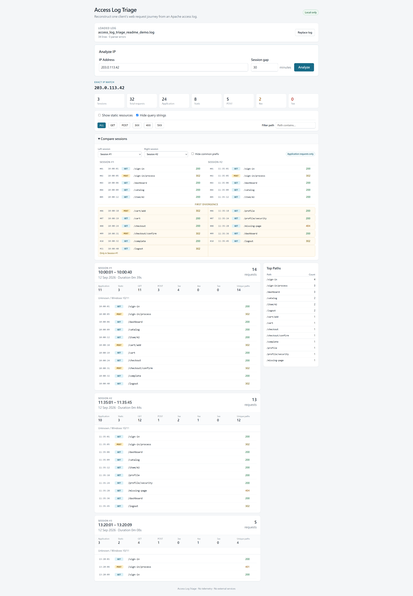
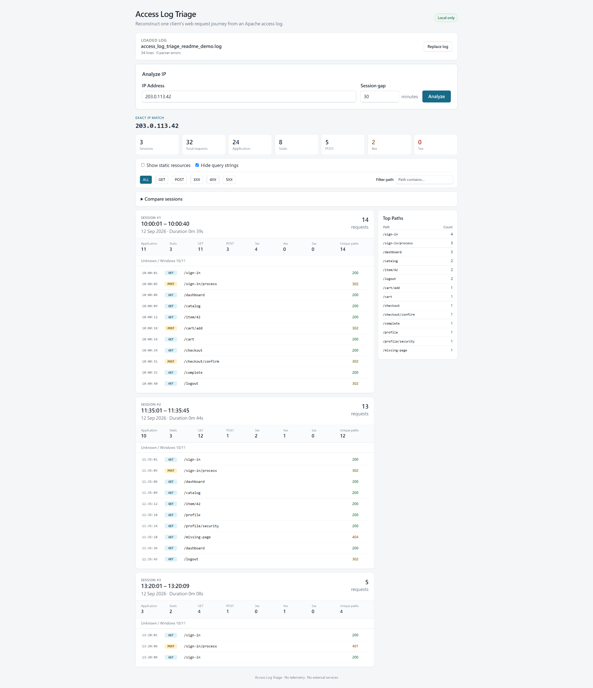

# Access Log Triage

**Reconstruct a client's web request journey from an Apache access log — then compare sessions to see exactly where behavior diverges.**

Access Log Triage is a small, local-first utility for investigating Apache access logs.

Load a log, enter an exact IPv4 or IPv6 address, and the tool reconstructs that client's requests into time-ordered sessions. When multiple sessions exist, you can compare their application journeys side by side and immediately identify the **first divergence**.

It is designed for focused human triage — not as a SIEM, IDS, WAF, or automated attack classifier.

## Why I built it

When investigating a specific source IP, the useful question is often not:

> "How many requests did this IP make?"

but:

> "What did this client actually do, in what order, and where did two visits begin to behave differently?"

Doing that manually with `grep`, timestamps, paths, query strings, and repeated log inspection is tedious.

Access Log Triage turns that workflow into:

```text
Apache access log
        ↓
Exact client IP
        ↓
Time-ordered requests
        ↓
Session reconstruction
        ↓
Application journey
        ↓
Session comparison
        ↓
First divergence
```



> All screenshots use synthetic Apache access-log data. No production traffic,
> real-world IP addresses, user information, or private application routes are shown.

## Highlights

### Reconstruct request journeys

Requests from the selected client are grouped into sessions using a configurable inactivity gap and shown chronologically.

Each session includes:

- start and end time
- duration
- request count
- application vs. static-resource requests
- GET / POST counts
- 4xx / 5xx counts
- unique paths
- most frequently requested paths
- individual request timeline

Static resources and query strings are hidden by default so the application journey remains easy to scan.

### Compare sessions

When an IP has at least two sessions, expand **Compare sessions** to inspect two application-only journeys side by side.

Comparison is deterministic and positional:

- compares HTTP method + normalized path
- aligns corresponding requests
- highlights the **first divergence**
- shows requests that exist only in one session
- does not automatically classify a difference as malicious or erroneous

This is particularly useful when comparing:

- a successful flow vs. a failed flow
- two penetration-test runs
- normal vs. unexpected navigation
- repeated form submissions
- authentication or workflow differences

### Exact IP triage

Enter an exact IPv4 or IPv6 address.

The application builds an in-memory IP index when the log is loaded, so repeated analysis does not rescan the entire file or duplicate parsed request objects.

### Local-first by design

All log processing happens locally.

There is:

- no telemetry
- no analytics
- no cloud API
- no CDN dependency
- no external reputation lookup
- no GeoIP lookup
- no persistent database
- no automatic blocking or security decision

The server binds only to:

```text
127.0.0.1
```

## Session analysis



## Supported logs

The parser supports Apache Common / Combined style access logs, including requests using:

- HTTP/1.0
- HTTP/1.1
- HTTP/2
- HTTP/2.0

Malformed lines are counted and skipped without aborting the analysis.

Maximum upload size:

```text
150 MiB
```

The input log is parsed once, line by line.

## Requirements

- Python 3.12 or newer
- A modern browser

## Installation

Use a project-local virtual environment.

Do not install the package globally.

### Windows PowerShell

```powershell
py -3.12 -m venv .venv
.\.venv\Scripts\Activate.ps1
python -m pip install -e ".[dev]"
```

### Ubuntu / Linux

```bash
python3.12 -m venv .venv
source .venv/bin/activate
python -m pip install -e ".[dev]"
```

## Run

### Quick start

Windows:

```powershell
.\run.cmd
```

Ubuntu / Linux:

```bash
./run.sh
```

The launcher uses the project `.venv`, starts the local server, and opens the default browser when supported.

Press `Ctrl+C` to stop the server.

If `.venv` does not exist, the scripts print the commands required to create it. They do not install packages automatically.

### Manual start

With the virtual environment active:

```bash
python -m access_log_triage
```

Then open:

```text
http://127.0.0.1:8000
```

Alternatively:

```bash
uvicorn access_log_triage.main:app --host 127.0.0.1 --port 8000
```

## Typical workflow

1. Load an Apache access log.
2. Enter an exact client IP.
3. Choose the session inactivity gap.
4. Select **Analyze**.
5. Review the reconstructed request sessions.
6. Hide or reveal static resources and query strings as needed.
7. If multiple sessions exist, expand **Compare sessions**.
8. Inspect the highlighted first divergence.
9. Drill into individual requests when additional context is needed.

The loaded log remains in process memory, so you can analyze multiple IPs without uploading or reparsing the file each time.

## Replacing a log

Use **Replace log** to load another access log.

Replacement is atomic:

- if the new file parses successfully, it becomes the active log
- if parsing fails, the current parsed log remains available

A successful replacement clears the previous IP analysis.

## Request details

Individual requests can expose additional evidence including:

- timestamp
- HTTP method
- normalized path
- status code
- referer
- raw User-Agent
- source line number

Query strings are hidden by default because access logs may contain sensitive parameters.

Reveal them only when necessary.

## Privacy and security

Access Log Triage is intentionally local-only.

Uploaded logs may temporarily be spooled by FastAPI / Starlette to an operating-system temporary file while being processed. The upload is closed immediately after parsing, including failed replacements.

The application itself retains only structured parsed records in memory.

Those records disappear when the application process stops.

Log content is rendered using Jinja2 autoescaping and a restrictive Content Security Policy.

## Scope

Access Log Triage organizes deterministic log evidence for human review.

It intentionally does **not**:

- classify attacks
- determine whether behavior is malicious
- query reputation services
- perform GeoIP lookups
- block clients
- call Wazuh
- modify firewall rules
- make automated security decisions

Its job is narrower:

> **Turn one client's raw Apache requests into a readable journey that an operator can reason about.**

## Tests

Run:

```bash
python -m pytest
```

The test suite uses synthetic data only, including:

```text
tests/fixtures/synthetic_journey.log
```

## License

MIT License
